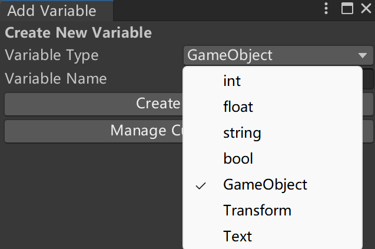

# 简介

简单实现的在编辑器窗口快速注入不同类型的变量，支持自定义注入的类型

# 快速使用

1. 将两个脚本复制到项目 Assets 目录下
2. 创建一个空物体，创建一个脚本挂载到物体上
3. 可以看到脚本的位置有一个按钮名为 Add Variable to Script，或者右键脚本同样会有一个新的菜单项 Add Variable to Script

4. 点击按钮，选择对应的 Type ，输入变量名，点击创建

   

5. 等待编译后变量已经注入到了你的脚本中

# 注意事项

脚本 ScriptVariableInjectorOverrideGUI 会重写脚本的GUI，如果你有插件也同样更改了脚本的GUI，请不要导入这个文件。去掉这个文件后只使用 ScriptVariableInjectorGUI 菜单项的功能如下：

